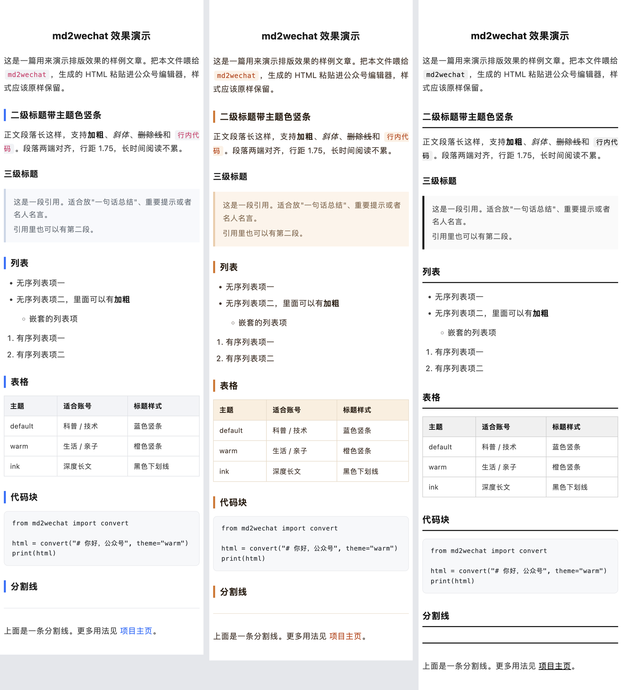

# md2wechat

[](LICENSE)
[](https://www.python.org/downloads/)
[](https://github.com/baozizhuang/md2wechat/releases)

把 **Markdown 一键转成可直接粘贴进微信公众号编辑器的排版 HTML**——全内联样式，复制粘贴不丢格式。

## 效果预览



从左到右依次为 `default`（清爽蓝）、`warm`（暖橙）、`ink`（墨黑），渲染内容见 [examples/example.md](examples/example.md)。生成 HTML 后用浏览器打开，全选复制、粘贴进公众号编辑器，即可得到图中效果。

## 为什么做这个

公众号编辑器会过滤 `<style>` 标签和 `class` 属性，直接粘贴普通 Markdown 渲染结果会丢光所有样式。md2wechat 的做法是：**先把 Markdown 渲染成 HTML，再把每个元素的样式全部写成内联 `style`**，只有内联样式能在"复制 → 粘贴到公众号编辑器"的过程中活下来。

适合：用 Markdown 写稿、讨厌在编辑器里手动调格式的公众号作者。

## 快速开始

```bash
pip install md2wechat        # 或者：pip install git+https://github.com/baozizhuang/md2wechat.git
md2wechat 文章.md            # 生成 文章.wechat.html
```

然后用浏览器打开生成的 `.wechat.html`，**全选 → 复制 → 粘贴进公众号编辑器**，排版就完成了。

### 换主题

```bash
md2wechat 文章.md -t warm      # 暖橙主题
md2wechat 文章.md --list-themes
```

| 主题 | 风格 | 适合 |
|---|---|---|
| `default` | 清爽蓝，蓝色竖条标题 | 科普 / 技术号 |
| `warm` | 暖橙色调 | 生活 / 亲子 / 人文号 |
| `ink` | 黑白极简，下划线标题 | 深度长文 |

### 管道用法

```bash
cat 文章.md | md2wechat > out.html        # 标准输入 → 标准输出
```

### 作为 Python 库

```python
from md2wechat import convert

html = convert("# 你好，公众号", theme="warm")
```

## 支持的元素

标题（H1–H6）、段落、加粗 / 斜体 / 删除线、行内代码、代码块、引用块、有序 / 无序列表（含嵌套）、表格、分割线、图片、链接。

## 加自己的主题

主题就是一张"元素 → 内联样式"的映射表，见 [`src/md2wechat/themes.py`](src/md2wechat/themes.py)。复制一份现有主题改改颜色就是新主题，欢迎 PR（见 [CONTRIBUTING.md](CONTRIBUTING.md)）。

## 路线图

- [x] CLI + 三套内置主题（v0.1.0）
- [ ] 自定义主题文件（YAML/JSON 传入）
- [ ] 代码块语法高亮
- [ ] 脚注 / 参考文献区优化
- [ ] 网页版（免安装，打开即用）

## 更新日志

见 [CHANGELOG.md](CHANGELOG.md)。

## License

[MIT](LICENSE) © baozizhuang
